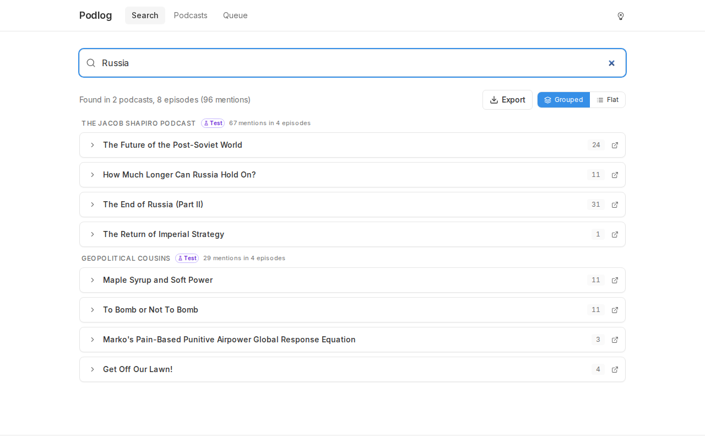

<div align="center">

# Podlog

**Self-hosted podcast transcription and search**

Add RSS feeds, transcribe episodes with Whisper, label speakers with pyannote, and search across all your transcripts — everything runs locally in Docker.


</div>



## Features

- **Hybrid search** — full-text keyword search with phrase matching (`"exact quotes"`, `OR`, `-exclude`) plus semantic vector search powered by pgvector
- **Speaker diarization** — automatic speaker labeling with per-episode renaming and AI-inferred speaker names
- **Granular timestamps** — sentence-level timestamps within speaker sections, clickable to play audio from any point
- **Persistent audio player** — click any timestamp to play; player continues across page navigation
- **Search export** — download search reports as Markdown, plain text, or print-friendly PDF
- **Queue dashboard** — live processing status, filter by stage, error classification with auto-retry
- **Episode reprocessing** — re-queue any episode from its page after model upgrades or config changes
- **Dark mode** — toggleable, remembers your preference
- **No cloud dependencies** — all data stays on your machine, no external API calls

## Quick Start

```bash
# 1. Clone
git clone https://github.com/brlauuu/podlog.git
cd podlog

# 2. Configure (set POSTGRES_PASSWORD and HF_TOKEN)
cp .env.example .env
nano .env

# 3. Build and start
make build
make up
```

Open **http://localhost:3000** — that's it.

> **First run:** The worker downloads Whisper and pyannote model weights (~3 GB). Jobs are queued during this phase and start processing once models are cached.

### Prerequisites

- [Docker](https://docs.docker.com/get-docker/) with [Compose V2](https://docs.docker.com/compose/install/)
- A free [HuggingFace](https://huggingface.co) account with an access token
- You **must accept the pyannote license** at [pyannote/speaker-diarization-3.1](https://huggingface.co/pyannote/speaker-diarization-3.1) before diarization will work
- `postgresql-client` (optional) — needed for host-level health monitoring (`sudo apt install postgresql-client`)

## Architecture

```
                        ┌──────────────────────────────────────────────┐
  Browser :3000  ──────>│  web (Next.js 14)                            │
                        │    Search, episodes, queue, audio player     │
                        │    Reads PostgreSQL directly for FTS/vector  │
                        │    Proxies to pipeline API for management    │
                        └──────────────┬───────────────────────────────┘
                                       │
                        ┌──────────────▼───────────────────────────────┐
  Pipeline API :8000 ──>│  pipeline (FastAPI)                          │
                        │    Feed management, queue control, health    │
                        │    Embed API (MiniLM query embedding)        │
                        └──────────────────────────────────────────────┘
                                       │
                        ┌──────────────▼───────────────────────────────┐
                        │  worker (Python)                             │
                        │    download → transcribe → diarize → embed  │
                        │    → infer speakers → archive                │
                        │    Sequential processing (concurrency=1)     │
                        │    Whisper + pyannote never in memory at once│
                        └──────────────┬───────────────────────────────┘
                                       │
                        ┌──────────────▼───────────────────────────────┐
                        │  db (PostgreSQL 15 + pgvector)               │
                        │    Episodes, segments, speaker names         │
                        │    FTS via GIN index + vector HNSW index     │
                        │    Job queue with FOR UPDATE SKIP LOCKED     │
                        └──────────────────────────────────────────────┘

                        ┌──────────────────────────────────────────────┐
  Ollama API :11434 ──> │  ollama (local LLM)                          │
                        │    RAG-based Ask AI feature                  │
                        └──────────────────────────────────────────────┘
```

5 containers. No Redis, no Celery — the job queue is PostgreSQL-backed.

## Configuration

Only two variables are required. Everything else has sensible defaults.

| Variable | Default | Description |
|---|---|---|
| `POSTGRES_PASSWORD` | *(required)* | PostgreSQL password |
| `HF_TOKEN` | *(required)* | HuggingFace access token for pyannote |
| `WHISPER_MODEL` | `large-v3-turbo` | Model size: `tiny`, `base`, `small`, `medium`, `large-v3`, `large-v3-turbo` |
| `WHISPER_COMPUTE_TYPE` | `int8` | `int8` (fast, recommended for CPU) or `float32` |
| `ARCHIVE_AUDIO` | `true` | Archive audio as compressed MP3 after transcription |
| `FEED_POLL_INTERVAL_HOURS` | `24` | How often to check feeds for new episodes |

See [docs/configuration.md](docs/configuration.md) for the full list of all environment variables.

## Documentation

| Document | Description |
|---|---|
| [User Guide](docs/guide/) | Step-by-step guide for new users: setup, features, configuration |
| [Configuration](docs/configuration.md) | All environment variables with defaults and explanations |
| [Hardware Guide](docs/hardware.md) | System requirements, processing benchmarks, tested machine specs |
| [Development](docs/development.md) | Local development setup, running tests, architecture notes, and Codex/Claude audit workflows |

## Common Commands

```bash
make up              # Start all services
make down            # Stop all services
make build           # Rebuild Docker images
make logs            # Follow logs for all services
make test-unit       # Run unit tests (398 tests)
make shell-db        # Open psql shell
make health-install  # Install health monitoring cron (every 15 min)
make help            # List all available commands
```

## Tech Stack

| Layer | Technology | Role |
|---|---|---|
| [WhisperX](https://github.com/m-bain/whisperX) | Whisper large-v3-turbo + CTranslate2 | Speech-to-text transcription |
| [faster-whisper](https://github.com/SYSTRAN/faster-whisper) | CTranslate2 backend | Fast CPU inference for Whisper |
| [pyannote](https://github.com/pyannote/pyannote-audio) | Speaker diarization 3.1 | Speaker labeling and separation |
| [sentence-transformers](https://www.sbert.net/) | all-MiniLM-L6-v2 | Semantic search embeddings (384-dim) |
| [pgvector](https://github.com/pgvector/pgvector) | PostgreSQL vector extension | Approximate nearest neighbor search |
| [Next.js](https://nextjs.org/) 14 | App Router, React Server Components | Web UI |
| [Tailwind CSS](https://tailwindcss.com/) + [shadcn/ui](https://ui.shadcn.com/) | Utility-first CSS + components | Styling |
| [FastAPI](https://fastapi.tiangolo.com/) | Python async web framework | Pipeline API |
| [PostgreSQL](https://www.postgresql.org/) 15 | Relational database | Storage, FTS, job queue, vector search |
| [Docker Compose](https://docs.docker.com/compose/) | Container orchestration | Deployment |

## Credits

Built by [@brlauuu](https://github.com/brlauuu) and [Claude](https://claude.ai) (Anthropic).

## License

[O'Saasy License](https://osaasy.dev). See [LICENSE](LICENSE).

**pyannote models** are subject to their own license — you must accept this independently at [huggingface.co/pyannote/speaker-diarization-3.1](https://huggingface.co/pyannote/speaker-diarization-3.1). Users are responsible for copyright compliance with podcast audio content.
